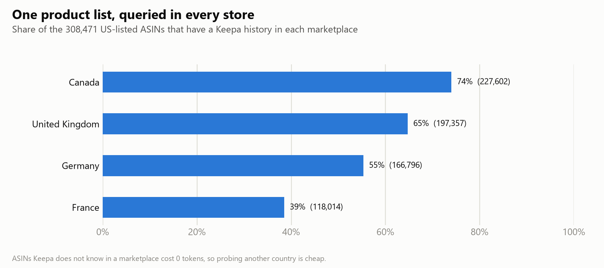
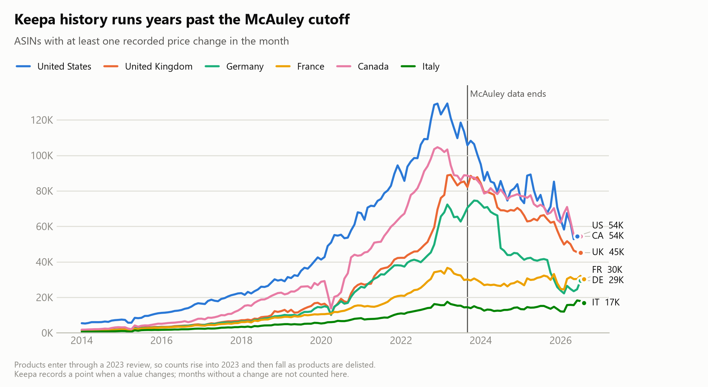
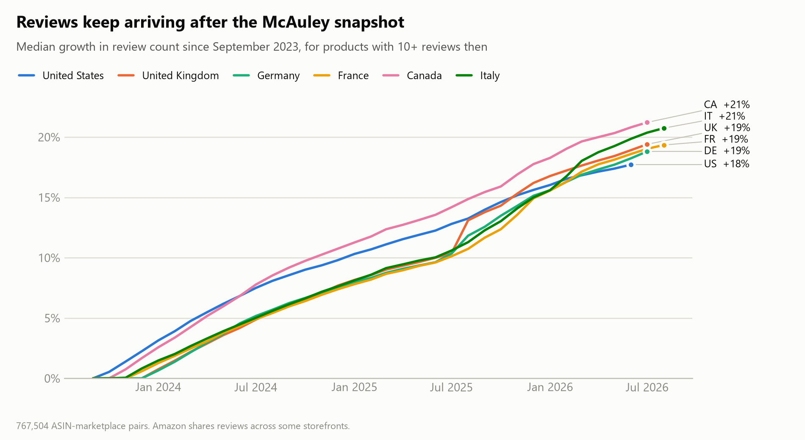
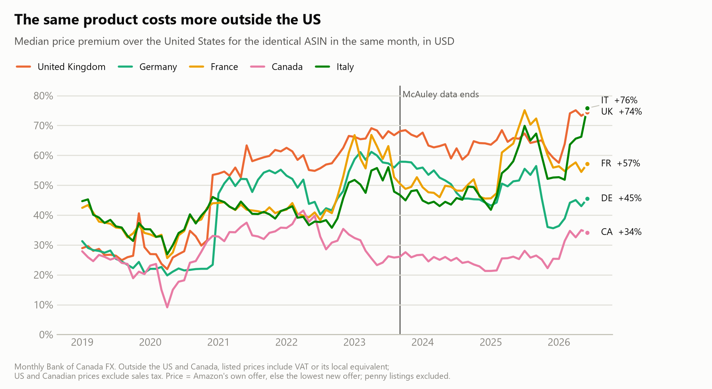
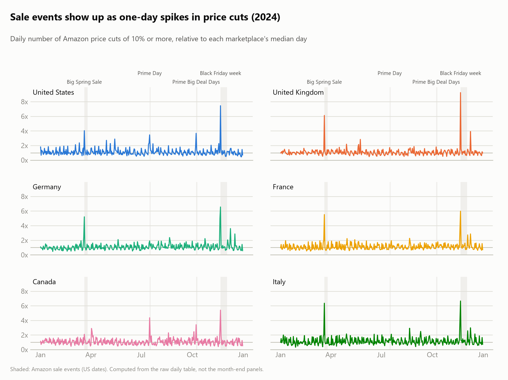

# amazon-market-sensing

Build a longitudinal, cross-country panel of Amazon products by combining McAuley Lab's [Amazon Reviews 2023](https://huggingface.co/datasets/McAuley-Lab/Amazon-Reviews-2023) with price, sales rank, rating and review-count histories from the [Keepa API](https://keepa.com/#!api).

McAuley's data stops in September 2023. Its product IDs still make a good sampling frame, because every product in it received real customer reviews. This pipeline takes the child ASINs of one McAuley category, pulls each one's full Keepa history in a reference marketplace (the US by default), then queries the same ASIN list in other Amazon marketplaces. Each country gets monthly and weekly panels keyed on the same `asin`, running from 2011 to the day you collect.

McAuley is the default starting list. You can also start from your own ASIN file, a Keepa Product Finder query or Amazon best-seller lists.

```
seed ASINs (McAuley category, your own list or a Keepa query)
  -> Keepa, US -> universe (has a US price, top 1% by price dropped)
  -> Keepa, UK / DE / FR / CA / ... -> cleaned monthly and weekly panels per country
```

## Quick start

```bash
git clone https://github.com/shayanAbbasi1995/amazon-market-sensing.git
cd amazon-market-sensing
python -m venv .venv && source .venv/bin/activate    # Windows: .venv\Scripts\activate
pip install -e .
cp .env.example .env                  # paste your KEEPA_API_KEY
cp config.example.yaml config.yaml    # choose the category and marketplaces

python -m amsense mcauley             # reviews and metadata (only for asins.source: mcauley)
python -m amsense collect -m us       # reference marketplace
python -m amsense universe            # the shared ASIN list
python -m amsense collect             # every other marketplace in config.yaml
python -m amsense panels              # monthly_obs, monthly_locf, weekly_locf
python -m amsense fx                  # optional: monthly FX rates for price comparisons
python -m amsense figures             # optional: the charts below, from your own data
```

Three settings in `config.yaml` decide what you collect:

- `asins.source` picks the starting products: `mcauley` (products reviewed in `review_window`), `file` (a .txt, .csv or .parquet list), `keepa_finder` (a Product Finder query exported from keepa.com with "Show API query") or `keepa_bestsellers` (Amazon category node ids).
- `category` is one of the 33 McAuley categories, or any folder name when you bring your own ASINs.
- `marketplaces` takes any of the 11 stores in Keepa's API: `us uk de fr jp ca it es in mx br`.

Check your key on two products first with `python -m amsense collect -m us --asins B08L5NP6NG,B08J8FFJ8H`. For a multi-week run, `docker compose -f docker/docker-compose.yml up -d --build` runs the whole sequence and resumes after a crash or reboot.

## Output

Everything lands under `data/<category>/`, which is gitignored.

| Path | Contents |
|---|---|
| `keepa/<CODE>/raw/` | every API response, gzipped before parsing; `collect --reprocess-raw` rebuilds all tables from it for 0 tokens |
| `keepa/<CODE>/history/`, `daily/` | long format, one row per (asin, series, point) or (asin, series, day) |
| `keepa/<CODE>/snapshot/`, `product/` | latest values; static attributes such as brand, category tree, dimensions and fees |
| `keepa/<CODE>/coverage/` | one row per requested ASIN: `ok`, `empty` or `not_found` |
| `panels/<CODE>/` | `monthly_obs`, `monthly_locf`, `weekly_locf` |

Panels carry the Amazon, new, used and list prices, sales rank, star rating, review count, and new and used offer counts. Prices stay in local currency, and every row has `marketplace` and `currency` columns. The cleaning rules live in [`cleaning.py`](src/amsense/cleaning.py): sentinels and placeholder prices are dropped, penny prices are flagged, and review counts are forced to be non-decreasing.

## Cost

A product with full history costs about 1.4 Keepa tokens. A product that a marketplace does not carry costs 0, so trying a new country is cheap. The 353K Electronics ASINs took about 17 days on the 20-tokens-per-minute plan. All marketplaces draw on one token bucket, so they are collected one after another.

## What the Electronics run shows

These figures come from McAuley's Electronics category: 353,160 child ASINs reviewed in 2023, narrowed to 308,471 that have a US price and cost under $1,184 (the 99th percentile). Keepa data was collected July to September 2026.



Keepa has history for 74% of the product list in Canada and 39% in France. 88,137 ASINs (29%) have history in all five marketplaces ([overlap matrix](figures/overlap.png)).



Because products enter the sample through a 2023 review, the number of active products rises into 2023 and falls afterward as items are delisted. Early years therefore over-represent products that survived until 2023.



Between September 2023 and mid-2026 the median product's review count grew another 18% (US) to 21% (Canada, Italy). None of those reviews are in the McAuley snapshot.



The same ASIN in the same month, converted at monthly exchange rates, cost 34% (Canada) to 76% (Italy) more than in the US in mid-2026. UK and EU prices include 19-22% VAT and US prices exclude sales tax, so tax explains part of the gap.



November 21, 2024, when Amazon's Black Friday week started, had the most price cuts of the year in all six marketplaces, 5 to 9 times a normal day. March 20 came second everywhere except Canada. Prime Day stands out only in the US and Canada.

## Limitations

- Buy-box and shipping-inclusive prices need Keepa's paid `offers` parameter and are not collected.
- Keepa stores a point only when a value changes. `monthly_obs` keeps the gaps; the `_locf` panels carry the last value forward.
- Sales rank is relative to a category and is not comparable across marketplaces.
- At the time of these figures, Italy had been queried for 52% of the universe and Spain not yet. Japan, India, Mexico and Brazil are supported but not yet collected. Prices are scaled by Keepa's documented units (cents, or whole yen).
- The `keepa_finder` and `keepa_bestsellers` sources are tested against recorded response shapes, not yet against a live key.
- Keepa data is subject to Keepa's terms of service.

## Citation

If you use the McAuley data, cite Hou, Li, He, Yan, Chen and McAuley (2024), *Bridging Language and Items for Retrieval and Recommendation*, [arXiv:2403.03952](https://arxiv.org/abs/2403.03952).

MIT license.
